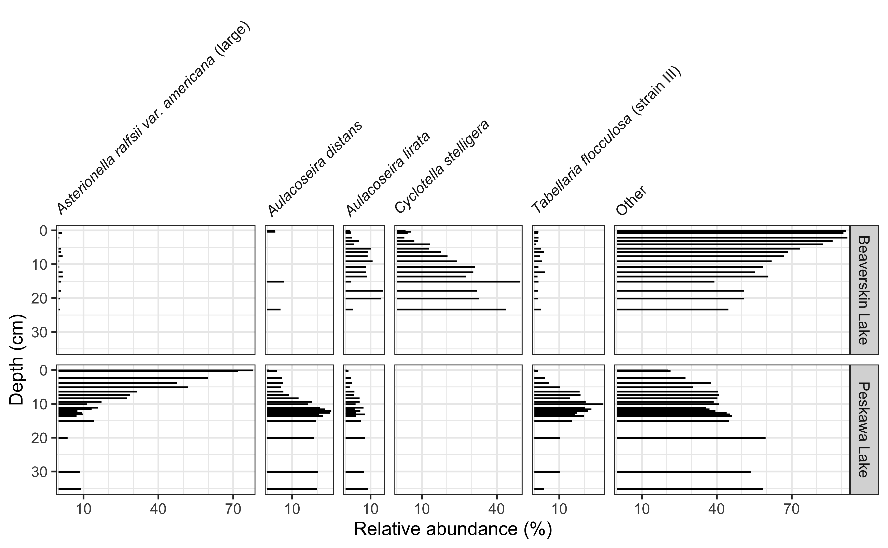

<!-- README.md is generated from README.Rmd. Please edit that file -->

# tidypaleo

<!-- badges: start -->

[](https://travis-ci.org/paleolimbot/tidypaleo)
[](https://codecov.io/github/paleolimbot/tidypaleo?branch=master)
[](https://www.tidyverse.org/lifecycle/#experimental)
<!-- badges: end -->

Working with multi-proxy paleo-archive data can be difficult. There are
multiple locations, multiple parameters, and a lot of
discipline-specific norms for plot layout and notation. This package
simplifies a few workflows to promote the use of R for reproducible
documents in paleo-based studies.

## Installation

You can install tidypaleo from github with:

``` r
# install.packages("remotes")
remotes::install_github("paleolimbot/tidypaleo")
```

## Examples

### Strat diagrams

This package exposes a number of functions useful when creating
stratigraphic diatrams, including `facet_abundanceh()`, which combines
several other functions to help create stratigraphic plots using
**ggplot2**. The `geom_col_segsh()` geometry draws horizontal sements,
which are commonly used to show species abundance data.

``` r
library(ggplot2)
library(tidypaleo)
theme_set(theme_bw())

ggplot(keji_lakes_plottable, aes(x = rel_abund, y = depth)) +
  geom_col_segsh() +
  scale_y_reverse() +
  facet_abundanceh(vars(taxon), grouping = vars(location)) +
  labs(y = "Depth (cm)")
```


