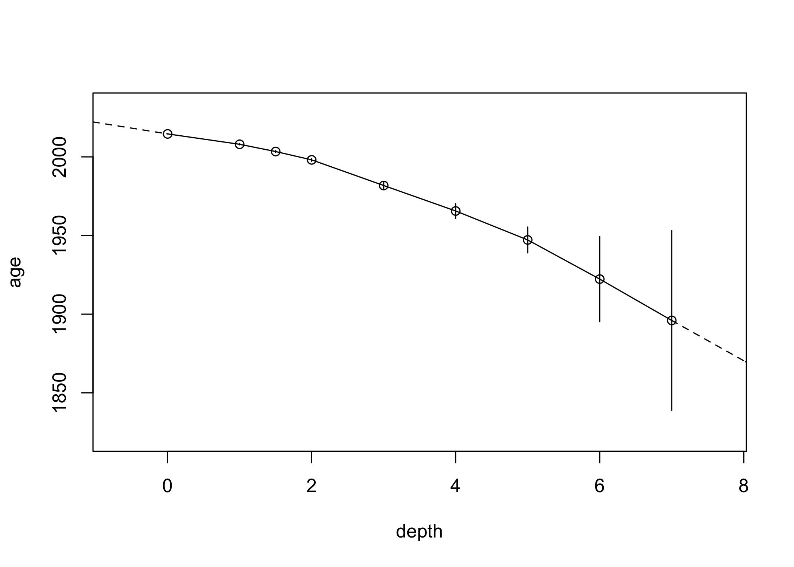

<!-- README.md is generated from README.Rmd. Please edit that file -->
[](https://travis-ci.org/paleolimbot/tidypaleo) [](https://codecov.io/github/paleolimbot/tidypaleo?branch=master)

tidypaleo
=========

Given a known depths and known (or modelled) ages, it is often convenient to approximate age as a continuous function of depth in an archive. This package provides tools to flexibly create age-depth relationships with various rules for interpolating age within known age-depth values, and extrapolating above and below these values. Typically, this is interpolation between known values and extrapolating using average sedimentation rates based on ages known at discrete points in a core.

Installation
------------

You can install tidypaleo from github with:

``` r
# install.packages("devtools")
devtools::install_github("paleolimbot/tidypaleo")
```

Example
-------

Using the built-in dataset `alta_lake_210Pb_ages`, which contains a Lead-210 (CRS) age-depth relationship for a core from [Alta Lake, Whistler, British Columbia](https://en.wikipedia.org/wiki/Alta_Lake_(British_Columbia)), we can create an age-depth model (note that `age` and `depth` are evaluated within `.data`, if it is provided, and support tidy evaluation):

``` r
library(tidypaleo)
alta_lake_adm <- age_depth_model(
  alta_lake_210Pb_ages,
  depth = depth_cm, age = age_year_ad,
  age_max = age_year_ad + age_error_yr, 
  age_min = age_year_ad - age_error_yr
)
#> Warning: package 'bindrcpp' was built under R version 3.4.4
alta_lake_adm
#> <age_depth_model>
#> Call: 
#> age_depth_model(
#>   .data = alta_lake_210Pb_ages, depth = depth_cm,
#>   age = age_year_ad, age_min = age_year_ad - age_error_yr,
#>   age_max = age_year_ad + age_error_yr
#> )
```

Then, we can plot the relationship:

``` r
plot(alta_lake_adm)
```


...Or predict raw data:

``` r
predict(alta_lake_adm, depth = seq(-1, 10, 0.5))
```

|  depth|       age|  age\_min|  age\_max| method             |
|------:|---------:|---------:|---------:|:-------------------|
|   -1.0|  2031.701|        NA|        NA| extrapolate\_above |
|   -0.5|  2023.150|        NA|        NA| extrapolate\_above |
|    0.0|  2014.600|   2014.60|   2014.60| interpolate        |
|    0.5|  2011.300|        NA|        NA| interpolate        |
|    1.0|  2008.000|   2007.66|   2008.34| interpolate        |
|    1.5|  2003.400|   2002.84|   2003.96| interpolate        |
|    2.0|  1998.100|   1997.24|   1998.96| interpolate        |
|    2.5|  1989.950|        NA|        NA| interpolate        |
|    3.0|  1981.800|   1979.55|   1984.05| interpolate        |
|    3.5|  1973.700|        NA|        NA| interpolate        |
|    4.0|  1965.600|   1960.87|   1970.33| interpolate        |
|    4.5|  1956.400|        NA|        NA| interpolate        |
|    5.0|  1947.200|   1938.99|   1955.41| interpolate        |
|    5.5|  1934.750|        NA|        NA| interpolate        |
|    6.0|  1922.300|   1895.28|   1949.32| interpolate        |
|    6.5|  1909.150|        NA|        NA| interpolate        |
|    7.0|  1896.000|   1838.81|   1953.19| interpolate        |
|    7.5|  1887.450|        NA|        NA| extrapolate\_below |
|    8.0|  1878.899|        NA|        NA| extrapolate\_below |
|    8.5|  1870.349|        NA|        NA| extrapolate\_below |
|    9.0|  1861.798|        NA|        NA| extrapolate\_below |
|    9.5|  1853.248|        NA|        NA| extrapolate\_below |
|   10.0|  1844.697|        NA|        NA| extrapolate\_below |

The default behaviour is to interpolate within known ages/depths, and extrapolate using a linear fit of ages/depths. These can be specified using transform functions, which take XY data and produce forward and inverse predictions based on them. The default call is:

``` r
age_depth_model(
  .data = NULL, depth, age, age_min = NA_real_,
  age_max = NA_real_, interpolate_age = trans_interpolate,
  extrapolate_age_below = ~trans_average(.x, .y, x0 = last, y0 = last),
  extrapolate_age_above = ~trans_average(.x, .y, x0 = first, y0 = first),
  interpolate_age_limits = trans_exact,
  extrapolate_age_limits_below = trans_na,
  extrapolate_age_limits_above = trans_na
)
```

To customize the behaviour of the predictions (e.g., disable extrapolating above or below), specify a transform function in the appropriate category. One-sided formulas are turned into functions using the `rlang::as_function()`. A more advanced way might be to only use the first/last few observations to extrapolate above and below, which one could do like this:

``` r
alta_lake_adm2 <- age_depth_model(
  alta_lake_210Pb_ages,
  depth = depth_cm, age = age_year_ad,
  age_max = age_year_ad + age_error_yr, 
  age_min = age_year_ad - age_error_yr,
  extrapolate_age_below = ~trans_average(
    tail(.x, 3), tail(.y, 3), x0 = dplyr::last, y0 = dplyr::last
  ),
  extrapolate_age_above = ~trans_average(
    head(.x, 3), head(.y, 3), x0 = dplyr::first, y0 = dplyr::first
  )
)

plot(alta_lake_adm2)
```


